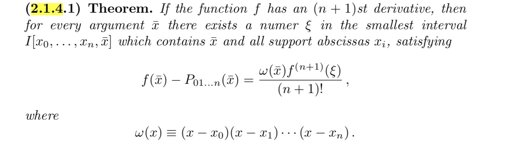
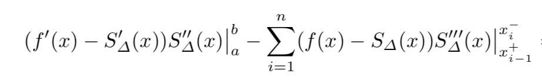
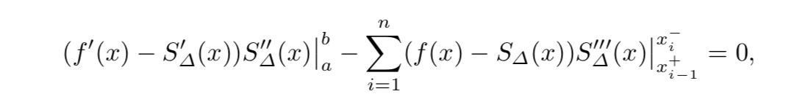

Interpolation
===

Index
---
<!-- TOC -->
- [Error in Polynomial Interpolation](#Error-in-Polynomial-Interpolation)
- [Cubic Spline](#Cubic-Spline)
<!-- /TOC -->

## How good is Polynomial Interpolation?

- if ![poly_1] is one of ![poly_2], holds
- else, consider ![poly_3]  
for k that makes ![poly_4]  
hence ![poly_5]  
- Then we have n+1 zeros
- F' has at least n+1 zeros in **I**, F'' has at least n zeros ,...
- ![poly_6] has at least 1 zero in **I** (![poly_8])
- ![poly_7]
- ...

> [Reference STBU 2.1.4]()

[poly_1]: http://chart.apis.google.com/chart?cht=tx&chl=\bar{x}
[poly_2]: http://chart.apis.google.com/chart?cht=tx&chl=x_j
[poly_3]: http://chart.apis.google.com/chart?cht=tx&chl=F(x)=f(x)-P_{01...n}(x)-kw(x)
[poly_4]: http://chart.apis.google.com/chart?cht=tx&chl=F(\bar{x})=f(\bar{x})-P_{01...n}(\bar{x})-kw(\bar{x})
[poly_5]: http://chart.apis.google.com/chart?cht=tx&chl=k=\frac{f(\bar{x})-P(\bar{x})}{w(\bar{x})}
[poly_6]: http://chart.apis.google.com/chart?cht=tx&chl=F^{n%2B1}
[poly_7]: http://chart.apis.google.com/chart?cht=tx&chl=k=\frac{f^{n+1}(\xi)}{(n%2B1)!}
[poly_8]: http://chart.apis.google.com/chart?cht=tx&chl=\xi

## Cubic Spline

### Exists?

![f_c1]

Given ![f_c8], 4n unkonwn

- ![f_c2] 
- ![f_c3] 
- ![f_c4] 
- ![f_c5] 

[f_c1]:http://chart.apis.google.com/chart?cht=tx&chl=P_i(x)=a_ix^3%2Bb_ix^2%2Bc_ix%2Bd_i
[f_c2]:http://chart.apis.google.com/chart?cht=tx&chl=P_{i-1}(x_{i-1})=y_{i-1}
[f_c3]:http://chart.apis.google.com/chart?cht=tx&chl=P_{i-1}(x_{i})=y_{i}
[f_c4]:http://chart.apis.google.com/chart?cht=tx&chl=P_{i-1}'(x_{i})=P_i'(x_{i})
[f_c5]:http://chart.apis.google.com/chart?cht=tx&chl=P_{i-1}''(x_{i})=P_i''(x_{i})
[f_c8]:http://chart.apis.google.com/chart?cht=tx&chl=(x_0,y_0),(x_1,y_1),\dots,(x_n,y_n)

We have n, n, n-1, n-1, in all 4n-2 equations with 2 degrees freedom

Common constraints:

- A. Natural Spline: 
![f_c6] 
- B. Periodic: 
![f_c7] 
for k = 0, 1, 2
- C. First Derivative Assignment: 
![f_c9] 
![f_c10] 

[f_c6]:http://chart.apis.google.com/chart?cht=tx&chl=S''_{\Delta}(a)=S''_{\Delta}(b)=0
[f_c7]:http://chart.apis.google.com/chart?cht=tx&chl=S^{k}_{\Delta}(a)=S^{k}_(b)
[f_c9]:http://chart.apis.google.com/chart?cht=tx&chl=S'_{\Delta}(a)=y_0'
[f_c10]:http://chart.apis.google.com/chart?cht=tx&chl=S'_{\Delta}(b)=y_n'

### Why Cubic?

- **Thm:**  
Let ![w_1] 
suppose f is sufficiently nice (see STBU), then 
![w_2] 
**I** = 

[w_1]:http://chart.apis.google.com/chart?cht=tx&chl={||f||}^2=\int_{a}^{b}{||f''(x)||}^2dx
[w_2]:http://chart.apis.google.com/chart?cht=tx&chl={||f-S_{\Delta}||}^2={{||f||}^2-{||S_{\Delta}||}^2-2I}

> [Reference STBU 2.4.1.4]()

- **Thm:** 
A or B or C constraint above holds, ![w_4] 
Minimum Curvature Property  

![w_5]

[w_3]:http://chart.apis.google.com/chart?cht=tx&chl={||f||}^2=\int_{a}^{b}{||f''(x)||}^2dx
[w_4]:http://chart.apis.google.com/chart?cht=tx&chl=I=0
[w_5]:http://chart.apis.google.com/chart?cht=tx&chl=f(x_i)=S_{\Delta}(x_i)

> [Reference STBU 2.4.1.5]()

## MLES

> [Reference More Yield Curve Modelling at the Bank of Canada page 41- 48]()

### discount factor & long term instantaneous forward rate

- discount factor: 
![mle1] 
- Note d(0) = 1  -> ![mle2] 
- ![zeta] are constants, D is dimension 

- argue ![alpha] is constant (long term instantaneous forward rate?)
    - try with ![mle3] 
    
    - ![mle4] 
    ![mle5] 
    
    - ![mle2] -> at least one ![onezeta] 
    take ![mle6] as the smallest index s.t. ![mle7] 
    - ![mle8] 

- ![mle9] instantaneous forward rate  

[mle2]:http://chart.apis.google.com/chart?cht=tx&chl=\zeta_{1}%2B\zeta_{2}%2B\dots%2B\zeta_{D}=1
[mle1]:http://chart.apis.google.com/chart?cht=tx&chl=d(t)=\sum_{k=1}^{D}\zeta_{k}e^{-k{\alpha}t}
[alpha]:http://chart.apis.google.com/chart?cht=tx&chl=\alpha
[zeta]:http://chart.apis.google.com/chart?cht=tx&chl=\zeta_{1},\zeta_{2},\dots,\zeta_{k}
[mle3]:http://chart.apis.google.com/chart?cht=tx&chl=\lim_{t\to\infty}\frac{d(t)}{\zeta_{1}e^{-{\alpha}t}}?=1
[mle4]:http://chart.apis.google.com/chart?cht=tx&chl=d_1(t)=e^{-2%t},\zeta_{1}=1,\alpha=2%
[mle5]:http://chart.apis.google.com/chart?cht=tx&chl=d_2(t)=0%2Be^{-2\time1%t},\zeta_{1}=0,\zeta_{2}=1,\alpha=1%
[onezeta]:http://chart.apis.google.com/chart?cht=tx&chl=\zeta_{i}\ne0
[mle6]:http://chart.apis.google.com/chart?cht=tx&chl=i_0
[mle7]:http://chart.apis.google.com/chart?cht=tx&chl=\zeta_{i_0}\ne0
[mle8]:http://chart.apis.google.com/chart?cht=tx&chl=\lim_{t\to\infty}\frac{d(t)}{\zeta_{i_0}e^{-{\alpha}t}}=1
[mle9]:http://chart.apis.google.com/chart?cht=tx&chl=i_0\alpha