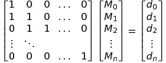

Mid Q5
===

<!-- TOC -->
- [Q5_i](#Q5_i)
- [Q5_ii](#Q5_ii)
- [Q5_iii](#Q5_iii)
- [Q5_iv](#Q5_iv)
<!-- /TOC -->

## Q5_i

- Yes :+1: (1pt)

![l1]

![l2]

- 3n equations 

- ![l3]  
  ![l4] 
  
  2n equations :+1: (2pt)
- ![l5]

  n - 1 equations :+1: (2pt)

[l1]: http://chart.apis.google.com/chart?cht=tx&chl=(x_0,\\,y_0),\dots,(x_n,\\,y_n),\\,x_0<x_1<\dots<x_n
[l2]: http://chart.apis.google.com/chart?cht=tx&chl=S_j(x)=\alpha_j%2B\beta_j(x-x_j)%2Br_j(x-x_j)^2
[l3]: http://chart.apis.google.com/chart?cht=tx&chl=S_j(x_{j%2B1})=S_{j%2B1}(x_{j%2B1})=y_{j+%2B1},\\,j=0,\dots,n-2
[l4]: http://chart.apis.google.com/chart?cht=tx&chl=S_0(x_0)=y_0,\\,S_{n-1}(x_n)=y_n
[l5]: http://chart.apis.google.com/chart?cht=tx&chl=S'_j(x_{j%2B1})=S'_{j%2B1}(x_{j%2B1}),\\,j=0,1,\dots,n-2

## Q5_ii

- ![l6] :+1: (2pt)
- for j = 0, 1, ..., n - 1 :+1: (2pt)
- ![l7] :+1: (2pt)
- for j = 0, 1, ..., n - 1 :+1: (2pt)
- ![l8]
  for j = 0, 1, ..., n - 1 :+1: (2pt)
- ![l9] :+1: (4pt)

***

- if by ![l10] 
for j = 0, 1, ..., n - 2 :+1: (2pt)
- get ![l9] for j = 0, 1, ..., n - 2 :+1: (2pt)
- one need to argue ![l11] :+1: (2pt)
    

[l6]: http://chart.apis.google.com/chart?cht=tx&chl=S_j(x_j)=y_j\rightarrow\\,\alpha_j=y_j
[l7]: http://chart.apis.google.com/chart?cht=tx&chl=S'_j(x_j)=M_j\rightarrow\\,\beta_j=M_j
[l8]: http://chart.apis.google.com/chart?cht=tx&chl=S'_j(x_{j%2B1})=M_{j%2B1}\\,\rightarrow\\,\beta_j%2B2r_j(x_{j%2B1}-X_j)=M_{j%2B1}
[l9]: http://chart.apis.google.com/chart?cht=tx&chl=r_j=\frac{M_{j%2B1}-M_j}{2(x_{j%2B1}-x_j)}
[l10]: http://chart.apis.google.com/chart?cht=tx&chl=\textit{\\,S'_j(x_{j%2B1})=S'_{j%2B1}(x_{j%2B1})}
[l11]: http://chart.apis.google.com/chart?cht=tx&chl=r_{n-1}=\frac{M_{n}-M_{n-1}}{2(X_{n}-x_{n-1})}

## Q5_iii

![l12]
![l13]

![l14]

![l15]

![l16]
for j = 0, ..., n - 1

with  ![l17]

![l18]

![l19] :+1: (11pt)

***

argue by induction gets full credits :+1: (11pt)

argue fill in one constraint gets partial :+1: (5pt) flexible + 2pts

[l12]: http://chart.apis.google.com/chart?cht=tx&chl=S_j(x)=\alpha_j%2B\beta_j(x-x_j)%2Br_j(x-x_j)^2
[l13]: http://chart.apis.google.com/chart?cht=tx&chl=x\in[x_j,\\,x_{j%2B1}]\\,n=0,1,\dots,n-1
[l14]: http://chart.apis.google.com/chart?cht=tx&chl=S_j(x)=\alpha_j%2BM_j(x-x_j)%2B\frac{M_{j%2B1}-M_j}{2(x_{j%2B1}-x_j)}(x-x_j)^2
[l15]: http://chart.apis.google.com/chart?cht=tx&chl=y_{j%2B1}=y_j%2BM_j(x-x_j)%2B\frac{M_{j%2B1}-M_j}{2}(x_{j+1}-x_j)
[l16]: http://chart.apis.google.com/chart?cht=tx&chl=\frac{2(y_{j%2B1}-y_j)}{x_{j%2B1}-x_j}=M_j%2BM_{j%2B1}
[l17]: http://chart.apis.google.com/chart?cht=tx&chl=M_0=y'_0
[l18]: http://chart.apis.google.com/chart?cht=tx&chl=A\vec{M}=\vec{d}
[l19]: http://chart.apis.google.com/chart?cht=tx&chl=det(A)>0

## Q5_iv

No, if the given y'0 is not a (the slope of the linear function ax+b), the result is not 
going to be a straight line. :+1: (7 pt) 

reasonable proof or example :+1: (3 pt)

(ex. ![l20] for i = 1, 2, ..., n but ![l21])

[l20]: http://chart.apis.google.com/chart?cht=tx&chl=d_i=2a
[l21]: http://chart.apis.google.com/chart?cht=tx&chl=d_0\neq2a

Correct proof for S being straight line given y'0 = a gets :+1: (3 pt)

Directly claiming Mj are identical gets no points. :worried: (since Mj = S'(xj))